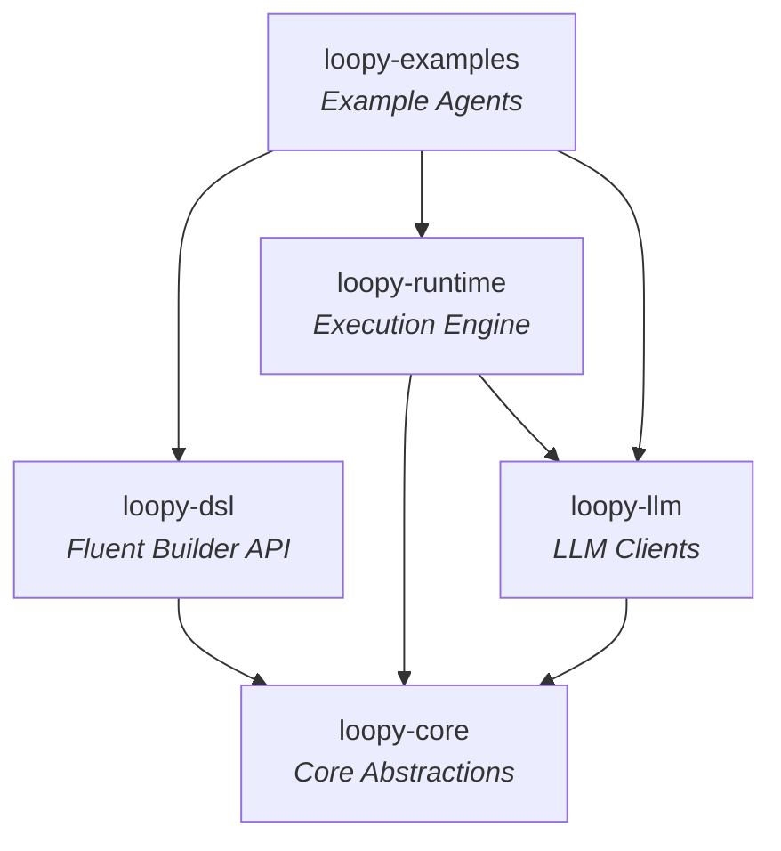
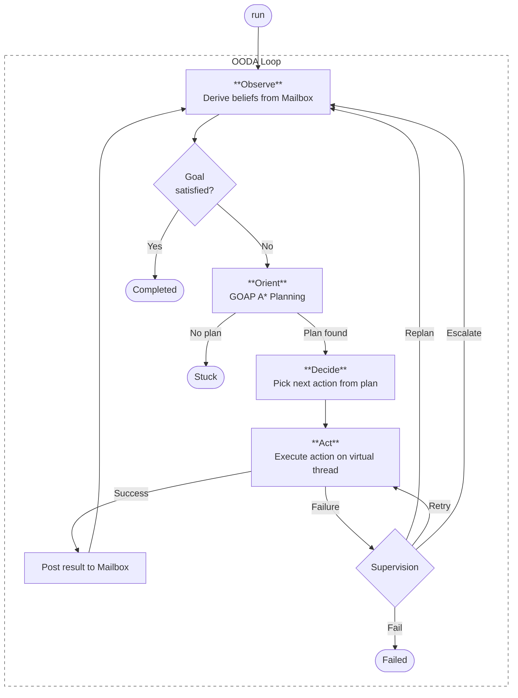
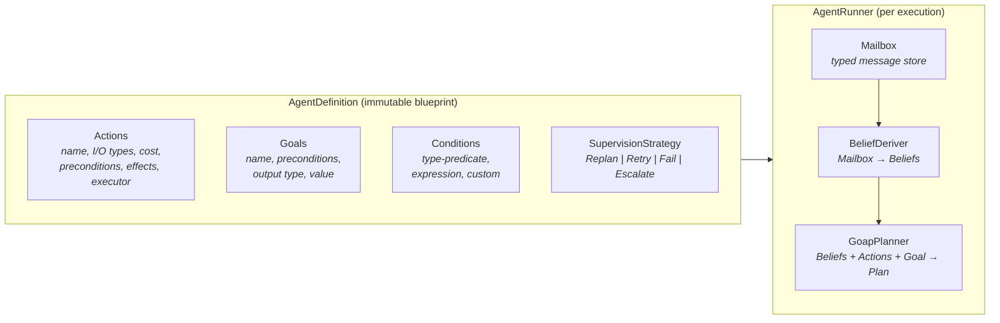
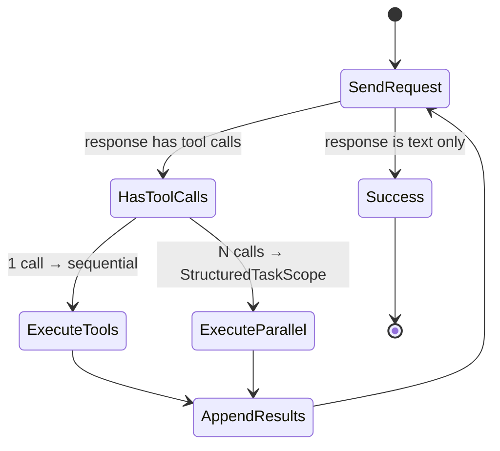

# Loopy

A framework-free, functional agent framework for Java 26.

Loopy combines **GOAP (Goal-Oriented Action Planning)** with **actor-model** execution patterns and **LLM integration** to build autonomous agents that plan, act, and adapt - all in idiomatic Java.

## Features

- **GOAP Planner** - A\* search finds the lowest-cost sequence of actions to reach a goal from the current world state
- **OODA Loop Runtime** - Observe, Orient, Decide, Act execution cycle with virtual threads
- **Actor Model** - Mailbox-based message passing, behavior switching, and lifecycle events
- **LLM Integration** - OpenAI client with tool-calling loop, structured output parsing, and cost tracking
- **Supervision Strategies** - Retry, Replan, Fail, or Escalate to LLM on action failures
- **Structured Concurrency** - Parallel tool execution via `StructuredTaskScope`
- **Zero Frameworks** - Pure Java 26 with preview features, no Spring/Quarkus/Micronaut

## Modules

| Module | Description |
|---|---|
| `loopy-core` | Core abstractions - agent definitions, actions, conditions, mailbox, planning, tools |
| `loopy-dsl` | Fluent builder API for constructing agents |
| `loopy-llm` | LLM client implementations (OpenAI) |
| `loopy-runtime` | Execution engine - agent runner, tool loop, execution tracing |
| `loopy-examples` | Example agents |

## Quick Start

### Prerequisites

- Java 26+
- Maven 3.9+

### Build

```bash
mvn compile
```

### Example: Star News Agent

```java
var llmClient = new OpenAiLlmClient(OpenAiConfig.fromEnvironment());

var agent = AgentBuilder.named("star-news")
        .describedAs("Researches a star and writes a news summary")
        .action("research-star")
            .describedAs("Gathers facts about a star using LLM")
            .input(StarInput.class).output(StarFacts.class)
            .cost(0.5)
            .executor(ctx -> researchStar(ctx, llmClient))
            .add()
        .action("write-summary")
            .describedAs("Writes a news-style summary from facts")
            .input(StarFacts.class).output(StarSummary.class)
            .cost(0.3)
            .executor(ctx -> writeSummary(ctx, llmClient))
            .add()
        .goal("star-summary-ready")
            .describedAs("A polished summary of the star has been produced")
            .satisfiedBy(StarSummary.class)
            .add()
        .build();

var goal = agent.goals().iterator().next();
var initialState = ImmutableMailbox.empty()
        .post(new StarInput("Betelgeuse"));

var runner = new AgentRunner(List.of(LifecycleListener.logging()));
var execution = runner.run(
        agent, goal, initialState, llmClient,
        ToolRegistry.empty(), new GoapPlanner(),
        new DefaultBeliefDeriver(), new RunOptions(10, 5,
                Duration.ofMinutes(2), List.of(),
                agent.defaultSupervision(), List.of()));
```

Run the example (requires `OPENAI_API_KEY` environment variable):

```bash
OPENAI_API_KEY=sk-... mvn -pl loopy-examples exec:java -Dexec.mainClass="com.loopy.examples.StarNewsAgent"
```

## Architecture

### Module Dependencies



### OODA Execution Loop



### Agent Definition & Data Flow



### Tool Loop (LLM Function Calling)



## Usage Guide

### Defining Domain Types

Agents exchange typed messages using Java records. These form the vocabulary your agent uses for input, output, and intermediate state.

```java
public record StarInput(String starName) {}
public record StarFacts(String starName, String facts) {}
public record StarSummary(String starName, String summary) {}
```

### Building an Agent

Use the fluent `AgentBuilder` DSL to define an agent with actions, goals, conditions, and a supervision strategy.

```java
var agent = AgentBuilder.named("star-news")
        .describedAs("Researches a star and writes a news summary")
        .action("research-star")
            .describedAs("Gathers facts about a star using LLM")
            .input(StarInput.class)
            .output(StarFacts.class)
            .cost(0.5)
            .executor(ctx -> {
                var input = ctx.input(StarInput.class);
                var response = ctx.llmClient().chat(
                        LlmRequest.simple("gpt-4o-mini",
                                "Tell me about the star " + input.starName()));
                return ActionResult.Success.of(
                        new StarFacts(input.starName(), response.message().content()),
                        response.usage());
            })
            .add()
        .action("write-summary")
            .describedAs("Writes a news-style summary from facts")
            .input(StarFacts.class)
            .output(StarSummary.class)
            .cost(0.3)
            .executor(ctx -> {
                var facts = ctx.input(StarFacts.class);
                var response = ctx.llmClient().chat(
                        LlmRequest.simple("gpt-4o-mini",
                                "Summarize these star facts:\n" + facts.facts()));
                return ActionResult.Success.of(
                        new StarSummary(facts.starName(), response.message().content()),
                        response.usage());
            })
            .add()
        .goal("star-summary-ready")
            .describedAs("A polished summary has been produced")
            .satisfiedBy(StarSummary.class)
            .add()
        .build();
```

### Actions with Preconditions and Effects

Actions can declare explicit preconditions and effects beyond what is inferred from input/output types. The planner uses these to find valid action sequences.

```java
AgentBuilder.named("data-pipeline")
        .action("fetch-raw")
            .input(RawRequest.class)
            .output(RawData.class)
            .establishes(Condition.custom("data-fetched"))
            .cost(0.3)
            .executor(ctx -> ActionResult.Success.of(fetchRaw(ctx)))
            .add()
        .action("validate")
            .input(RawData.class)
            .output(ValidatedData.class)
            .requires(Condition.custom("data-fetched"))
            .establishes(Condition.custom("data-validated"))
            .cost(0.2)
            .executor(ctx -> ActionResult.Success.of(validate(ctx)))
            .add()
        .action("export")
            .input(ValidatedData.class)
            .output(ExportResult.class)
            .requires(Condition.custom("data-validated"))
            .revokes(Condition.custom("data-fetched"))
            .cost(0.1)
            .executor(ctx -> ActionResult.Success.of(export(ctx)))
            .add()
        .goal("export-complete")
            .satisfiedBy(ExportResult.class)
            .add()
        .build();
```

### Custom Conditions

Conditions are evaluated against the mailbox. You can register type-predicate conditions, expression-based conditions, or fully custom evaluators.

```java
AgentBuilder.named("review-agent")
        .condition("score-high", ReviewScore.class,
                score -> score.value() >= 0.8)
        .condition("ready-to-publish", ReviewScore.class,
                "value >= 0.8 && !needsEdit", myExpressionEngine)
        .action("approve")
            .input(ReviewScore.class)
            .requiresPredicate("score-high", ReviewScore.class,
                    score -> score.value() >= 0.8)
            .output(ApprovedReview.class)
            .cost(0.2)
            .executor(ctx -> ActionResult.Success.of(approve(ctx)))
            .add()
        .goal("review-approved")
            .satisfiedBy(ApprovedReview.class)
            .add()
        .build();
```

### Mailbox

The mailbox is the agent's working memory - a typed, append-only message store. Actions read inputs from it and post outputs to it.

```java
var mailbox = ImmutableMailbox.empty()
        .post(new StarInput("Betelgeuse"));

StarInput input = mailbox.last(StarInput.class).orElseThrow();
List<Object> all = mailbox.messages();

mailbox = mailbox.post(new StarFacts("Betelgeuse", "..."));
StarFacts facts = mailbox.last(StarFacts.class).orElseThrow();
```

### LLM Client

The `LlmClient` port supports free-form chat and structured output generation. Use the OpenAI implementation or provide your own.

```java
var config = OpenAiConfig.fromEnvironment();
var client = new OpenAiLlmClient(config);

LlmResponse response = client.chat(
        LlmRequest.simple("gpt-4o-mini", "Explain GOAP planning"));

System.out.println(response.message().content());
System.out.println("Tokens: " + response.usage().totalTokens());

LlmObjectResult<AnalysisResult> structured = client.createObject(
        LlmRequest.simple("gpt-4o-mini", "Analyze this text...")
                .withSystemPrompt("You are a data analyst."),
        AnalysisResult.class);
System.out.println(structured.value());
```

### Connecting to OpenAI-Compatible Endpoints

The `OpenAiConfig` supports custom base URLs for local or self-hosted LLM providers.

```java
var config = OpenAiConfig.of("my-key", "http://localhost:11434/v1");
var client = new OpenAiLlmClient(config);
```

### Tools

Register tools with the `ToolRegistry` to enable LLM function calling. Tools are described by name, description, JSON Schema parameters, and an executor.

```java
var tools = ToolRegistry.empty()
        .with(new Tool(
                "get_weather",
                "Get the current weather for a city",
                JsonSchemaGenerator.schemaStringFor(WeatherRequest.class),
                args -> {
                    var city = parseCity(args);
                    return "{\"temperature\": 72, \"condition\": \"sunny\"}";
                }))
        .with(new Tool(
                "search_web",
                "Search the web for information",
                JsonSchemaGenerator.schemaStringFor(SearchRequest.class),
                args -> searchTheWeb(parseQuery(args))));
```

### Tool Loop

The `ToolLoop` drives multi-turn LLM function-calling conversations. Multiple parallel tool calls are executed concurrently via `StructuredTaskScope`.

```java
var request = LlmRequest.simple("gpt-4o-mini", "What's the weather in Paris and Tokyo?")
        .withTools(tools.all());

ToolLoopResult result = ToolLoop.execute(client, request, tools, 10);

switch (result) {
    case ToolLoopResult.Success s ->
        System.out.println(s.response().message().content());
    case ToolLoopResult.MaxIterationsReached m ->
        System.out.println("Hit limit after " + m.iterations() + " rounds");
    case ToolLoopResult.Interrupted i ->
        System.out.println("Interrupted: " + i.reason());
}
```

### Supervision Strategies

Configure how the agent handles action failures at the agent level or per-run.

```java
AgentBuilder.named("resilient-agent")
        .supervision(new SupervisionStrategy.Retry(3, Duration.ofSeconds(2)))
        .action("call-api")
            .executor(ctx -> callExternalApi(ctx))
            .add()
        .action("fallback")
            .executor(ctx -> useCachedData(ctx))
            .add()
        .goal("data-retrieved")
            .satisfiedBy(DataResult.class)
            .add()
        .build();
```

Available strategies:

| Strategy | Behavior |
|---|---|
| `Replan` | Skip and re-plan from current state (default) |
| `Retry` | Retry the failed action up to N times with backoff |
| `Fail` | Terminate the agent immediately |
| `Escalate` | Ask the LLM to decide (self-healing) |

### Lifecycle Listeners

Observe agent execution in real time. Listeners receive every lifecycle event - useful for logging, monitoring, human-in-the-loop handoffs, or custom tracing.

```java
var listener = LifecycleListener.logging();

var customListener = (LifecycleListener) event -> {
    switch (event) {
        case AgentLifecycleEvent.ActionCompleted e ->
            System.out.println("Done: " + e.action().name()
                    + " in " + e.duration().toMillis() + "ms");
        case AgentLifecycleEvent.ActionFailed e ->
            System.err.println("Failed: " + e.action().name()
                    + " - " + e.cause().getMessage());
        case AgentLifecycleEvent.Replanned e ->
            System.out.println("New plan: " + e.newPlan().stepCount() + " steps");
        default -> {}
    }
};

var composed = listener.andThen(customListener);
var runner = new AgentRunner(List.of(composed));
```

### Running an Agent

Wire everything together and run. The `AgentRunner` executes the OODA loop on virtual threads until the goal is reached, the agent gets stuck, or a failure occurs.

```java
var runner = new AgentRunner(List.of(LifecycleListener.logging()));
var execution = runner.run(
        agent,
        goal,
        ImmutableMailbox.empty().post(new StarInput("Betelgeuse")),
        llmClient,
        tools,
        new GoapPlanner(),
        new DefaultBeliefDeriver(),
        new RunOptions(
                10,                             // maxSteps
                5,                              // maxPlans
                Duration.ofMinutes(2),          // timeout per action
                List.of(),                      // pricingModels
                agent.defaultSupervision(),     // supervision strategy
                List.of()                       // additional listeners
        ));

switch (execution) {
    case AgentExecution.Completed completed -> {
        var summary = (StarSummary) completed.result();
        System.out.println(summary.summary());
        System.out.println(completed.trace().costSummary());
    }
    case AgentExecution.Stuck stuck ->
        System.err.println("Agent stuck: " + stuck.reason());
    case AgentExecution.Failed failed ->
        System.err.println("Agent failed: " + failed.cause().getMessage());
}
```

### Execution Tracing

Every run produces an `ExecutionTrace` with full auditability - step durations, token usage, cost, and all lifecycle events.

```java
case AgentExecution.Completed completed -> {
    ExecutionTrace trace = completed.trace();

    System.out.println("Steps: " + trace.steps().size());
    System.out.println("Tokens: " + trace.totalTokens().totalTokens());
    System.out.println("Cost: $" + trace.totalCost());
    System.out.println("Models: " + trace.modelsUsed());
    System.out.println("Duration: " + trace.totalDuration());

    for (var step : trace.steps()) {
        System.out.printf("  %s: %s (%dms)%n",
                step.actionName(),
                step.result() instanceof ActionResult.Success ? "OK" : "FAIL",
                step.duration().toMillis());
    }

    System.out.println(trace.costSummary());
}
```

### Multiple Goals

Agents can pursue different goals in separate runs using the same definition.

```java
var agent = AgentBuilder.named("analyzer")
        .action("collect")
            .input(Request.class).output(RawData.class)
            .cost(0.3)
            .executor(ctx -> collect(ctx))
            .add()
        .action("analyze")
            .input(RawData.class).output(Analysis.class)
            .cost(0.5)
            .executor(ctx -> analyze(ctx))
            .add()
        .action("summarize")
            .input(Analysis.class).output(Summary.class)
            .cost(0.2)
            .executor(ctx -> summarize(ctx))
            .add()
        .goal("full-analysis")
            .satisfiedBy(Analysis.class)
            .add()
        .goal("summary-only")
            .satisfiedBy(Summary.class)
            .add()
        .build();

GoalDefinition analysisGoal = agent.goals().stream()
        .filter(g -> g.name().equals("full-analysis"))
        .findFirst().orElseThrow();

GoalDefinition summaryGoal = agent.goals().stream()
        .filter(g -> g.name().equals("summary-only"))
        .findFirst().orElseThrow();

var runner = new AgentRunner(List.of(LifecycleListener.logging()));

var deepResult = runner.run(agent, analysisGoal, initial, llm,
        tools, planner, beliefDeriver, options);

var quickResult = runner.run(agent, summaryGoal, initial, llm,
        tools, planner, beliefDeriver, options);
```

## Testing

```bash
mvn test
```

## License

Private - all rights reserved.
